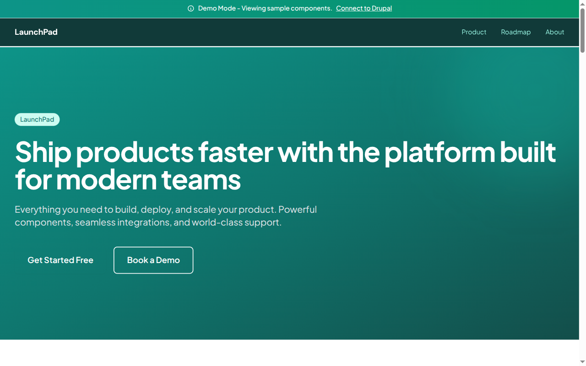

# Decoupled Startup

A startup landing page starter built with Next.js and Drupal (via Decoupled.io). Uses paragraph-style components to build flexible, content-managed landing pages with an about page.



## Features

- **Paragraph Components**: Hero, Cards, Accordion, Testimonials, Pricing, Logos, Stats, Newsletter, and more
- **About Page**: Dedicated company/team page
- **Decoupled Drupal**: Content management via Decoupled.io with GraphQL API
- **Demo Mode**: Fully functional preview with mock data -- no backend required
- **Modern Design**: Tailwind CSS with customizable color themes
- **TypeScript**: Fully typed for better developer experience

## Quick Start

### 1. Install & Setup

```bash
npm install
npm run setup
```

The interactive setup script guides you through creating a Drupal space and importing sample content.

### 2. Start Development Server

```bash
npm run dev
```

Open [http://localhost:3000](http://localhost:3000) to see your site.

### Demo Mode

To run without any backend:

```bash
NEXT_PUBLIC_DEMO_MODE=true npm run dev
```

## Environment Variables

| Variable | Description | Required |
|----------|-------------|----------|
| `DRUPAL_BASE_URL` | Your Drupal space URL | Yes |
| `DRUPAL_CLIENT_ID` | OAuth client ID | Yes |
| `DRUPAL_CLIENT_SECRET` | OAuth client secret | Yes |
| `NEXT_PUBLIC_DEMO_MODE` | Enable demo mode (`true`) | Optional |

## Project Structure

```
decoupled-startup/
├── app/
│   ├── api/graphql/           # Drupal GraphQL proxy
│   ├── about/page.tsx         # About page
│   ├── components/
│   │   ├── Header.tsx
│   │   ├── Footer.tsx
│   │   ├── DemoHomepage.tsx   # Demo mode landing page
│   │   ├── LandingPageCard.tsx
│   │   ├── paragraphs/       # Paragraph components
│   │   │   ├── ParagraphHero.tsx
│   │   │   ├── ParagraphCardGroup.tsx
│   │   │   ├── ParagraphAccordion.tsx
│   │   │   ├── ParagraphLogoCollection.tsx
│   │   │   └── ParagraphNewsletter.tsx
│   │   └── ui/               # Shared UI components
│   └── [...slug]/page.tsx     # Dynamic routing
├── lib/
│   ├── apollo-client.ts       # GraphQL client
│   ├── queries.ts             # GraphQL queries
│   └── types.ts
└── data/
    └── mock/                  # Demo mode mock data
```

## Customization

### Colors & Branding
Edit `tailwind.config.js` to customize colors, fonts, and spacing.

### Paragraph Components
React components are in `app/components/paragraphs/`. Update them to match your design needs.

## Commands

| Command | Description |
|---------|-------------|
| `npm run dev` | Start development server |
| `npm run build` | Build for production |
| `npm run setup` | Interactive setup wizard |
| `npm run setup-content` | Import sample content |

## Deployment

1. Push to GitHub
2. Import in Vercel
3. Add environment variables
4. Deploy

Set `NEXT_PUBLIC_DEMO_MODE=true` for a demo deployment without backends.

## License

MIT
